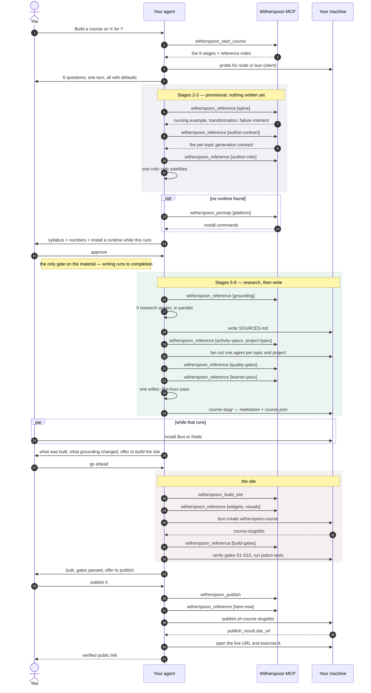

# Witherspoon

Generate a complete, grounded course — readings, flashcards, quizzes, unit tests, and graded
hands-on projects — then build it into a self-contained static website and host it for free — *zero
programming knowledge needed*.

**→ [See a finished course](https://course-from-apps-to-machines.vercel.app)** — *Same File, Three Addresses*: 4 units, 12 topics, quizzes and tests, interactive widgets, and a
printable certificate.

**Connect to MCP**
```
https://witherspoon.up.railway.app/mcp
```
or **Install the Skill**
```
npx skills add colinmollenhour/witherspoon
```

----

What is it, technically? Four agent skills plus one shared [Astro](https://astro.build) template. The skills are plain
directories of Markdown, so any agent harness that loads skills can run them. The site builder is
ordinary Node and runs on its own.

Two ways in. **Connect the MCP server** and ask your agent for a course — it fetches each stage as it
needs it, and the only thing that ever lands on your machine is the course itself plus the site
builder. Or **copy the skills** into a harness that loads them from disk. The pipeline is identical
either way; the MCP server serves the same files.

## Requirements

Your agent does the work either way — it interviews you, researches, writes the files, runs the
build. The two routes differ only in how the pipeline reaches it, and that is the only requirement
that changes.

### Over MCP — an agent that can add a remote MCP server

That is the entire requirement. **No skills are involved**: the server hands your agent one stage at
a time as tool results, so there is nothing to copy to disk, nothing for a harness to load, and
nothing to re-sync when the pipeline changes. If your agent takes an MCP URL, it can run Witherspoon.

### From skills — a harness that loads skills from disk

Each skill is a `SKILL.md` with YAML frontmatter and a `references/` directory, loaded per stage so
the entry file stays small. `.claude/skills/` is the conventional location — copy or symlink
elsewhere if your harness looks somewhere else. Where a tool has a Claude Code-specific name, the
skills give the capability first and the name as an example. Nothing calls a model vendor's API
directly.

### What both routes ask of the agent

The instructions are the same files, so the capabilities they call for are the same too, each with a
stated fallback:

| Capability | Used for | Without it |
| --- | --- | --- |
| File and shell access | writing the course, running the build | *required* past the interview |
| Web search + web fetch | the grounding expedition | *required* — grounding is the point |
| Batched multiple-choice question | the interviews | ask as one numbered list |
| Parallel subagents | writing topics and projects | run the same contracts sequentially |

And, on your machine rather than in the agent:

- **Node 20.19+ (or 22.13+, or 24+) or Bun 1.1+** for the site template. npm and bun are equally
  supported; use whichever you already have. Either one alone runs the whole build, gates and
  jsdom tests included. It is needed only for the **website** — the course material is written
  without it, which is why nothing asks you to install anything until the material is done.
- **Optional external tools** for visuals: a diagram CLI and an image generator. `course-site` probes
  for them and degrades to a styled text panel if absent — the build never blocks on a picture.

## Quick start — over MCP

Add the server to your agent by URL. No authentication, nothing to install, no repository to clone:

```
https://witherspoon.up.railway.app/mcp
```

Then ask for what you want:

> Help me create a course using Witherspoon for my 3rd grade science class on the water cycle.

Your agent fetches the pipeline one stage at a time, interviews you once, stops at a single approval
gate, and then works autonomously. Somewhere around that gate it will hand you a one-line command to
install Bun or Node — do it while the course generates, and the website builds at the end. If you
skip it, you still get the complete course material as Markdown.

Your agent needs file and shell access for anything past the interview. Hosting the server yourself
is `cd mcp-server && npm install && npm run sync && npm start`; see [`mcp-server/`](mcp-server/).

## Quick start — from a checkout

```bash
git clone https://github.com/colinmollenhour/witherspoon.git
cd witherspoon
```

**1 · Generate the material.** Point your agent at the repo and ask:

> Build a course on *&lt;subject&gt;* for *&lt;audience&gt;*.

`course-builder` asks six questions in one turn — audience, feel, size, structure, licence, and
copyright holder, each with a recommended default — then proposes a running example and an outline
and stops. That approval is the only gate. After it, the skill researches the subject, grounds every
figure in a real source, writes `SOURCES.md`, and fans out to write each topic and project into
`course-<slug>/`.

**2 · Review it.** The output is a readable Markdown tree plus `course.json`. Read the readings,
check `SOURCES.md`, fix what you disagree with.

**3 · Build the site.** From the directory that *contains* `course-<slug>/`:

```bash
bun create witherspoon-course        # or: npm create witherspoon-course
```

That installs the builder, writes the scripts, and runs the first build. Then:

```bash
bun run verify        # gates S1–S15
bun run test          # runtime behaviour in jsdom
```

Or ask your agent to run `course-site`, which also plans and generates the diagrams and unit hero
images before building.

Always go through `bun run <script>` / `npm run <script>`. On a machine with Bun and no Node the bare
`node_modules/.bin/witherspoon-course` shim cannot execute — its `#!/usr/bin/env node` line has
nothing to resolve and the shell exits 127.

**4 · Preview.**

```bash
bun run dev                                     # live reload — use this
```

That runs Astro's dev server, so edits to a reading appear on save. Serving the built output
statically is for inspecting `dist/` itself, or for the two manual gates (subpath deploy, and loading
with JavaScript off) — not for reading the course back:

```bash
cd course-<slug>/dist && python3 -m http.server 8000
```

**5 · Publish — free.** Ask your agent to publish the course. The default is
[here.now](https://here.now/docs): the agent uploads `course-<slug>/dist` via API (create → upload →
finalize, or the official `publish.sh` helper) and returns the live URL from that publish result. No
GitHub, no CI, no browser drag-and-drop. Anonymous publishes need no account and expire in 24 hours;
a free account makes Sites permanent once the agent saves an API key locally (credentials file or
env var — never paste a key into chat) — see [pricing](https://here.now/pricing.md). The agent opens
the resulting URL from the public internet to check it before calling it published.

Vercel remains available as an **advanced alternative**: drag `dist/` onto
[vercel.com/drop](https://vercel.com/drop), or use the Vercel CLI for one-command republishes into the
same project. Prefer those when you specifically want Vercel, or when the agent cannot run shell
commands on your machine and a browser drop is the only workable route.

A course site is static files with no backend, which makes it essentially free to host. here.now is
the default because an agent can publish the built folder directly and the shareable link is a bare
hostname (`https://your-course.here.now`) with `index.html` at the root. Netlify and Cloudflare Pages
are built in too, and naming any other provider and upload mechanism will use that instead. Every
route is direct artifact upload; nothing goes through a repository or CI.

**Then keep editing.** `bun run dev` for small changes — a reworded paragraph appears on save. When
you say it looks good, the agent commits the course source and re-cuts the build, then republishes
(or hands you back the `dist/` folder on a browser-drop route). It does not publish on its own; that
stays your call.

## Output layout

```
course-<slug>/
  course.json                    the full course graph — structure and all assessment data
  README.md                      about, skills, faqs, syllabus
  SOURCES.md                     grounding ledger: claim → source → verbatim quote
  assets/                        generated diagrams and hero images
  unit-1-foundations/
    topic-1-cpu-vs-gpu/
      _contract.md               generation prompt + grounded facts + requested activities
      read.md  flashcards.md  quiz.md
    unit-test.md
    project-1-baseline/
      brief.md  rubric.md  starter/  tests/
  dist/                          the built site
```

## What makes a course good

The quality model came from pulling apart professionally-built courses in three domains — systems
programming, sales, and high-school maths — and asking what the good ones had in common that the
mediocre ones didn't. It was not format variety; nine activity types are table stakes and explain
nothing. What separated them was structural.

1. **A running example threads the entire course.** One artefact carried through every topic and
   re-measured at each step — a CUDA `add()` over 1M floats going 3 ms on the CPU → 75 ms on one GPU
   thread (*deliberately worse*) → 4.2 ms on one block → 47 µs once memory is prefetched. Nothing
   else does as much for coherence; activity variety is decoration on top of it.

2. **Failure moments are designed in.** The learner hits the wall *before* being handed the fix, and
   the course says so out loud rather than letting them conclude they broke something. The
   cliffhanger is written into the unit description, so the next unit has somewhere to land.

3. **Objectives are observable actions with the real API embedded.** Three per topic. *"Write a
   grid-stride loop that handles arrays larger than the launch's total thread count"* — not
   "understand parallelism". **Every quiz explanation cites the objective it assesses**, as
   `(objective 2)`. That traceability is why the assessments aren't filler: an objective no question
   covers becomes a visible, checkable defect.

4. **An intermediate representation sits between outline and content.** Each topic carries a
   `_contract.md` — a generation prompt plus an activity manifest with counts — that the outline
   stage writes *for* the writing stage, including how the topic hands off to its neighbours. This
   is the mechanism that makes parallel generation coherent: N topics can be written by N
   independent workers and still interlock.

5. **Projects are graded three ways at once.** `steps[]` with machine-checkable completion criteria
   (*"stdout contains `Max error: 0`"*, not *"student understands prefetching"*), a weighted
   `rubric[]` summing to 100, and executable `testCases[]` — including at least one adversarial case
   aimed at the plausible shortcut. Plus a pinned `environment`, so results reproduce.

6. **Course framing is concrete.** The subtitle states a before→after with numbers. `skills[]` are
   performance statements, not nouns. `faqs[]` answer real objections, starting with *"why not just
   read the official docs?"* — and the answer has to be specific about what the official treatment
   leaves out.

7. **Every topic changes the running example's state.** Mentioning the artifact is not enough.
   `Leaves` must differ from `Inherits`. A tool-skill that does not move the spine is a sidebar,
   not a topic with its own quiz.

8. **The page teaches; the ledger proves.** Verbatim quotes and `[src N]` live in `SOURCES.md`.
   The reading teaches the claim in the teacher's voice. Isolated writers will paste the ledger
   unless the contract forbids it and a later pass strips what leaked through.

## `course.json`

The course graph, abridged to the fields that carry pedagogical weight. Full schema in
`.claude/skills/course-builder/references/schema.md`.

```
course
  title, slug, about, structureTemplate: "project-based" | "academic"
  skills[]   faqs[]   spine { runningExample, transformation, failureMoment }
  sources[]  { id, claim, value, source, angle }
  units[]
    title, description                # description ends on the hook into the next unit
    topics[]
      instructions                    # the generation contract
      learningGoals[]                 # 3 per topic, observable, API-bearing
      activities[]                    # { type, path } — the join to read.md
      flashcards[]   quiz
    test  { passingScore, questions[] }     # explanation MUST cite "(objective N)"
    projects[]
      goal, type, config, steps[], rubric[], testCases[], environment
```

**Assessment data lives in the JSON, not the Markdown.** `quiz.md`, `flashcards.md` and
`unit-test.md` are reviewable views rendered *from* it, and nothing parses them back:

```bash
bunx witherspoon-course-template render-views --course <course-dir> [--check]
```

That direction is load-bearing. When quizzes existed only as prose, the site builder had to recover
each answer key from five hand-written Markdown dialects through a ranked cascade of eight guessing
strategies — including one where `**Correct:** 2` meant a 1-based ordinal and another where
`**Correct option index:** 2` meant a 0-based index. A course should not have to infer which answer
is correct; the model that wrote the question already knew.

## Pipeline

`course-builder` runs nine stages, with exactly one human gate on the syllabus:

1. **Scan** *(silent)* — orient over the working directory and any attached sources.
2. **Interview** — six questions in one turn, each with a recommended default. Size is a band,
   not a quota; the default is ~3 units / 6–10 topics.
3. **Spine** *(provisional)* — pick the running example, the measurable transformation, and the
   default dialect *before* outlining. Unconfirmed numbers are marked `?`.
4. **Outline** *(provisional), then criticise it* — units, topics, objectives, and a `_contract.md`
   per topic. A critic that did not write the contracts cuts satellites (`Leaves` must differ from
   `Inherits`) before anyone sees the syllabus.
5. **Approve** — **the only gate on the outline.** The user approves the criticised syllabus.
   Approving opts into both fan-outs; after it, work runs autonomously.
6. **Ground** — parallel research across five angles: primary source · authoritative numbers ·
   current-state check · misconception harvest · prior-art gap. Produces `SOURCES.md`.
7. **Refine** — corrected numbers propagate to the spine, subtitle, and every contract; harvested
   misconceptions become quiz distractors; the prior-art gap becomes the "why this over the docs"
   FAQ. An invalidated premise is the one finding that reopens the gate.
8. **Generate** — one subagent per topic and per project, each handed only its own contract and its
   ledger rows. **No agent may introduce a number absent from its grounded facts.** The page
   teaches; the ledger stays in `SOURCES.md`.
9. **Verify, then the learner pass** — structural gates, then one editor that did not write the
   topics reads the course as a first-hour learner and applies cuts (no new facts, no syllabus
   change). Re-check anything it touched.

### Quality gates — the build fails on any

- an objective with no assessment covering it
- a quiz explanation missing its `(objective N)` citation
- rubric weights that do not sum to 100
- a `completionCriteria` no machine can check
- a project with no adversarial test case
- a topic that does not change the running example's state (`Leaves` equals `Inherits`)
- `[src N]` or view-count rhetoric in a file the learner reads
- a project brief over 1,200 words
- a first topic that is only a lecture
- an unpinned project environment
- **a number that traces to no ledger row** — fabrication, not a placeholder
- a `SOURCES.md` row without a resolvable source, a paraphrased "quote", or a surviving `?`

## The site template

`course-site` validates the course, generates its visuals, runs `course-template/`, and checks the
gates. It does not write pages and does not write a builder — courses hold content, the template
holds the site, so fixing a bug once fixes every course.

```bash
bun run build     bun run dev       bun run verify
bun run test      bun run check-widgets         bun run render-views
```

**What it builds:** a home page with a progress ring and resume link · one page per topic carrying
reading, flashcards and quiz · unit tests · project pages with persisted step checklists · a
printable certificate · client-side search. Quizzes give immediate per-question feedback, score
first attempts only, and — because every explanation cites its objective — report a **per-objective
breakdown** of what to review. Readings can embed eight kinds of interactive widget (`anatomy`,
`flow`, `compare`, `terminal`, `match`, `order`, `sequence`, `tree`), compiled at build time so no
renderer ever reaches the browser.

**Four constraints, all load-bearing:**

- **No auth, no backend.** Every page is a static file.
- **No external requests.** No CDN fonts, no analytics, no remote images, nothing off-origin. It
  renders fully offline.
- **State lives only in `localStorage`**, namespaced `course:<slug>:v1`, and the site stays usable
  when storage is disabled, full, or corrupt.
- **Content works without JavaScript.** JS adds progress, grading and flair — never the words.

Path-independence is the one a bundler quietly breaks: Astro emits root-absolute `/_astro/…` URLs,
so the runtime and stylesheet are bundled by esbuild into `assets/site.js` and `assets/site.css` and
referenced with a prefix computed from each page's depth. Gate S2 fails on any surviving `/_astro/`
reference, so a regression is caught rather than discovered on deploy.

Content collections validate `course.json` against zod schemas at build time, so a bad answer key
fails the build naming the entry and the field rather than producing a site that grades wrongly.

The certificate states on its face that it is a **self-reported completion record** stored only in
that browser. The architecture can verify nothing, so the page never implies it does.

## The MCP server

`mcp-server/` serves the same four skills over MCP, so a course can be authored with nothing
installed. It ships **instructions only**. A server reached over a URL has no filesystem and no shell
on your machine, so every tool returns a document and your agent does the work with its own tools —
which means it needs file and shell access. A chat-only client can run the interview and nothing
else, and the server says so rather than half-building a course.

Six tools. The descriptions carry the routing vocabulary, so *"help me build a course for my 3rd
grade science class"* reaches the builder, and *"this course is hard to follow"* reaches the
reviewer, without anybody naming a tool:

| Tool | Returns | Called |
| --- | --- | --- |
| `witherspoon_start_course` | the nine-stage authoring pipeline | once, at the start of a new course |
| `witherspoon_review_course` | the first-hour review pipeline | when a course already exists and is hard to follow |
| `witherspoon_reference` | one of 17 reference documents | at each stage that names one |
| `witherspoon_build_site` | the site-build pipeline | after you approve the material |
| `witherspoon_publish` | the publishing pipeline | when you ask for a public URL |
| `witherspoon_prereqs` | Node/Bun install commands per platform | only if the runtime probe fails |

**One document per call, never all at once.** The skills total ~153 KB; returned together they would
spend most of a context window before any work began, and would defeat the per-stage split the
`references/` directories exist to provide. The tool descriptions cost about 1.1k tokens and are
always in context; a stage costs 2.8–4.5k when fetched.

### How a course gets built



A course that already exists and is hard to follow is a different door. Say so in a new chat —
*"this is too dense"*, *"review this course"* — and the agent calls `witherspoon_review_course`
instead of starting over. It reads the lessons as a first-hour learner, tells you what to change,
and waits. It does not rebuild the syllabus unless you ask.

Two things that diagram is meant to make obvious. **There is exactly one gate on the outline** —
once you approve the syllabus, the writing runs to completion without stopping, which is why the
runtime install is raised *there*, to be done in parallel with a fan-out that takes twenty minutes or
more. And **references are fetched at the stage that needs them**, not up front; that is the whole
reason the pipeline fits in a context window alongside the course being written.

The default publish runs on the agent via here.now. Choosing Vercel Drop instead is the step that is
genuinely yours in the browser; the Vercel CLI route keeps republishes with the agent.

`content/` in the server is generated from `.claude/skills/` by `tools/sync-content.mjs`, and
`npm run check` fails if it has drifted — editing a `SKILL.md` and forgetting to sync would quietly
serve last month's pipeline. The server is stateless, so it replicates and restarts freely.

## Reference

| Document | Covers |
| --- | --- |
| `course-builder/references/spine.md` | picking the running example and the transformation |
| `course-builder/references/outline-contract.md` | the per-topic generation contract format |
| `course-builder/references/outline-critic.md` | cut satellite topics before the approval gate |
| `course-builder/references/learner-pass.md` | first-hour review rubric (in-pipeline editor and invoked review) |
| `course-review/SKILL.md` | review an existing course; diagnose, wait, then apply |
| `course-builder/references/grounding.md` | the five-angle expedition and the `SOURCES.md` ledger |
| `course-builder/references/activity-specs.md` | per-type rules: length, structure, counts |
| `course-builder/references/project-types.md` | the 8 project types, environments, rubrics |
| `course-builder/references/quality-gates.md` | the fail-the-build checklist |
| `course-builder/references/schema.md` | the full `course.json` shape |
| `course-builder/references/runtime-setup.md` | installing Node or Bun, and when to raise it |
| `course-site/references/site-spec.md` | the design contract the template implements |
| `course-site/references/state.md` | the `localStorage` contract and every failure mode |
| `course-site/references/build-gates.md` | what each of S1–S15 means |
| `course-site/references/widgets.md` | the widget catalogue, for authors |
| `course-site/references/visuals.md` | composing diagram and infographic skills; fallbacks |
| `course-publish/references/here-now.md` | default host: API/`publish.sh`, anonymous vs permanent, republish |
| `course-publish/references/vercel.md` | advanced alternative: browser drop, CLI route, custom hostnames |

## The name

**John Witherspoon** (1723–1794) — sixth president of the College of New Jersey, delegate to the
Continental Congress, and the only active clergyman to sign the Declaration of Independence. He is
the namesake as an educator: he took over a small, indebted college in 1768 and rebuilt both what it
taught and how, and his standing rests less on any doctrine he left behind than on what his students
— James Madison and Aaron Burr among them — could afterwards go and do.

That is the standard this project borrows. A course earns its keep by what a learner can do at the
end of it; the observable objectives, the machine-checkable rubrics, and the gates all exist to keep
that claim honest rather than merely asserted.

## Licence

Copyright © 2026 Colin Mollenhour. Three licences, split along one line: **anything that can end up
inside a site you publish is permissive; everything else is copyleft.**

| Part | Licence | Why |
| --- | --- | --- |
| `course-template/` | [MIT](course-template/LICENSE) | its JS and CSS ship inside every course site you build |
| everything else — the skills, `mcp-server/`, `create-witherspoon-course/` | [GPL-3.0-or-later](LICENSE) | tooling; never embedded in your output |
| `course-from-apps-to-machines/` | CC BY 4.0 | it is course content, not software |

The practical consequence: **a course site you build and publish carries no copyleft obligation.**
The template's runtime is bundled into `assets/site.js` and `assets/site.css`, and under MIT you may
ship that anywhere, including commercially, keeping only the copyright notice.

Your course itself is never touched by any of this. Each one carries whatever licence you chose at
the interview — all rights reserved, CC BY-NC-ND 4.0, CC BY 4.0, or CC0 1.0 — recorded in its own
`course.json` and printed in the footer of every page. Generating a course with this tooling no more
licenses the course under the GPL than writing an essay in a GPL editor does.

## Sources

*Same File, Three Addresses* is grounded in **186 ledger rows across 41 distinct sources**, recorded in
its [`SOURCES.md`](course-from-apps-to-machines/SOURCES.md) with a verbatim quote against each claim.
The bulk are primary and normative: Microsoft Learn for the WSL and Windows paths, the RFC Editor for
HTTP and IP behaviour, Ubuntu man pages and the Open Group base specifications for shell commands,
MDN for URL and web semantics, and IANA for port registrations.

Everything else here — the quality model, the pipeline, the contract format, the gates — is our own.
